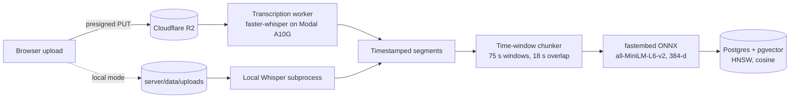
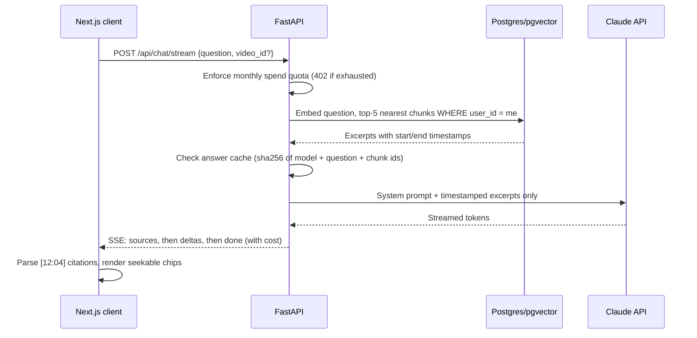

# Pumped Up Kicks

**Ask your lecture a question. Get the answer, and the exact second your professor said it.**

Recorded lectures are long, and the one explanation you need is buried somewhere in hour two. Pumped Up Kicks turns each recording into a searchable, citable memory. Upload a video, ask in plain English, and get a grounded answer where every claim carries a timestamp like `[12:04]`. Click it and the player jumps to that moment.

Answers come only from your own lectures. If the lecture never covered it, the assistant says so instead of guessing.

---

## How it works

### Ingest: video to searchable chunks



Each upload moves through `queued → transcribing → indexing → ready` (or `failed` with a reason), persisted on the `videos` row so the UI can poll real progress instead of showing a spinner.

### Ask: question to cited answer



Claude never sees the audio or the full transcript, only the handful of excerpts that matched the question, packed into a 12K-token context budget.

---

## Engineering decisions worth reading

**Chunk by time, not by segment count.** Whisper segments are a few seconds each, too small to carry an idea. The indexer builds ~75-second windows (about a paragraph of explanation) with 18 seconds of overlap, so a sentence that straddles a boundary is still retrievable whole. Fewer, more complete excerpts per answer means cheaper prompts and better grounding.

**Tenant isolation lives in the query, not the app.** Retrieval is a single SQL statement: cosine distance over the HNSW index, joined to `videos`, filtered by `chunks.user_id`. Two students can upload the same `lecture1.mp4` with overlapping content and each retrieves only their own. Deleting a lecture is an indexed `DELETE`, which under the original FAISS design meant rebuilding the entire index.

**A cache that invalidates itself.** The answer cache key is a hash of the model, the normalized question, and the IDs of the chunks retrieved. Re-index a lecture and the chunk IDs change, so stale answers can never be served. Cache hits cost $0 and are counted in usage stats.

**Spend limits that can't drift.** Per-user monthly spend is summed directly from the `messages` ledger (every answer stores its `cost_usd`), not tracked in a separate counter. The quota is checked before every Claude call and returns `402` when a plan's limit is reached.

**Signed playback for a tag that can't authenticate.** A `<video>` element cannot send an `Authorization` header. `/playback` returns a short-lived URL instead: an R2 presigned URL in production, or an HMAC-SHA256 token over (object key, user, expiry) for local storage. Both support HTTP range requests, which is what makes seeking work.

**Citations are data, not decoration.** `message_sources` links each answer to the exact chunks behind it, so the timestamp strip survives a reload and every answer is auditable.

**Lean API container.** Embeddings run on ONNX via fastembed (same MiniLM weights, no PyTorch), and GPU transcription is offloaded to a serverless Modal worker with the model baked into the image. The API image drops from ~2.5 GB to ~300 MB and scales to zero cost when idle.

**Swappable backends behind one interface.** `STORAGE_BACKEND=local|r2` and `TRANSCRIBE_BACKEND=local|modal` change infrastructure without touching application code. The client handles both upload paths (direct-to-bucket or through the API) with no code change.

---

## Tech stack

| Layer | Technology |
|---|---|
| Frontend | Next.js 15 (App Router), React 18, TypeScript, Tailwind CSS, Server-Sent Events |
| API | FastAPI, Pydantic v2, pydantic-settings, Uvicorn |
| Retrieval | PostgreSQL 17, pgvector (HNSW, `vector_cosine_ops`), fastembed (ONNX), all-MiniLM-L6-v2 |
| Transcription | faster-whisper on Modal (A10G GPU, serverless) or OpenAI Whisper locally, ffmpeg/ffprobe |
| LLM | Anthropic Claude (Sonnet by default) with adaptive thinking, low effort, streaming, per-call cost accounting |
| Data | SQLAlchemy 2.0, Alembic migrations, psycopg 3 |
| Auth | Clerk (JWT verified against JWKS), dev-mode bypass with a visible DEV MODE badge |
| Storage | Cloudflare R2 over the S3 API (boto3), presigned uploads and playback |
| Deploy targets | Vercel (client), Railway (API), Neon (Postgres), Modal (GPU worker) |

---

## Data model

| Table | Purpose |
|---|---|
| `users` | Clerk user id, email, plan |
| `videos` | Per-user lecture metadata, storage key, duration, processing stage and progress |
| `chunks` | Transcript windows with `start_s`/`end_s` and a `vector(384)` embedding, HNSW-indexed |
| `conversations` | Per-lecture chat threads |
| `messages` | Questions and answers, with token counts and `cost_usd` |
| `message_sources` | Which chunks backed which answer |
| `answer_cache` | Content-addressed answers, with hit counts |

---

## API

| Method | Path | Purpose |
|---|---|---|
| `POST` | `/api/videos/presign` | Get a presigned R2 upload URL |
| `POST` | `/api/videos/{id}/complete` | Confirm a direct upload and queue processing |
| `POST` | `/api/videos/upload` | Multipart upload through the API (local storage) |
| `GET` | `/api/videos` | List lectures with stage and progress |
| `GET` | `/api/videos/{id}/status` | Lightweight polling during processing |
| `GET` | `/api/videos/{id}/playback` | Short-lived signed playback URL |
| `DELETE` | `/api/videos/{id}` | Remove the file, chunks, and vectors |
| `POST` | `/api/chat/query` | Ask a question, get answer + sources + cost |
| `POST` | `/api/chat/stream` | Same, streamed over SSE |
| `GET` | `/api/chat/conversations` | List threads |
| `GET` | `/api/chat/conversations/{id}` | Thread with messages and citations |
| `GET` | `/api/chat/usage` | Spend, question count, cache hits, quota |
| `GET` | `/health` | Liveness, model in use, key configured |

Interactive docs at `http://localhost:8000/docs`.

---

## Run it locally

**Prerequisites:** Python 3.11+, Node.js 18+, `ffmpeg`, PostgreSQL 17 with pgvector, an Anthropic API key.

```bash
# Database
brew install postgresql@17 pgvector
brew services start postgresql@17
createdb kicks_dev
psql -d kicks_dev -c "create extension vector;"

# API
cd server
python3 -m venv venv && source venv/bin/activate
pip install -r requirements.txt -r requirements-local.txt   # local adds Whisper
cp .env.example .env                                        # set ANTHROPIC_API_KEY
alembic upgrade head
./start_server.sh                                           # http://localhost:8000

# Client (new terminal)
cd client
npm install
npm run dev                                                 # http://localhost:3000
```

With `AUTH_MODE=dev` there is no sign-in; every request acts as one built-in user. Set a monthly spend cap in the Anthropic Console before exposing anything beyond localhost.

Going to production (Clerk, R2, Modal, Neon, Railway, Vercel) is covered step by step in [SETUP.md](SETUP.md), including an estimated cost of **$34 to $73/month at 50 users**.

---

## Project structure

```
client/
  src/app/            landing page and /app workspace
  src/components/     VideoPlayer (cited-passage scrubber), ChatInterface, UsageMeter, ...
  src/lib/            timestamps.ts (citation parsing), Clerk wiring
  src/services/       REST + SSE clients
server/
  api/routes/         chat.py, videos.py
  api/services/       lecture_rag_service, indexer, quota, signing, storage, auth, video_processor
  src/services/       claude_client (the only file that calls Claude), embedder, whisper_transcriber
  alembic/            schema migrations
  modal_app.py        serverless GPU transcription worker
```

---

## Known limits and next steps

- Background processing uses FastAPI `BackgroundTasks`; a restart mid-transcription loses the job. Next: a durable queue (Redis + RQ).
- No full transcript view yet, only the excerpts an answer cited.
- Planned: route simple questions to Haiku and add a reranker over the top-k results.
- English lectures only for now.

---

## Team

Sejal Hukare, Ishita Pawar, Rajvardhan Patil, Chetan Monhot
