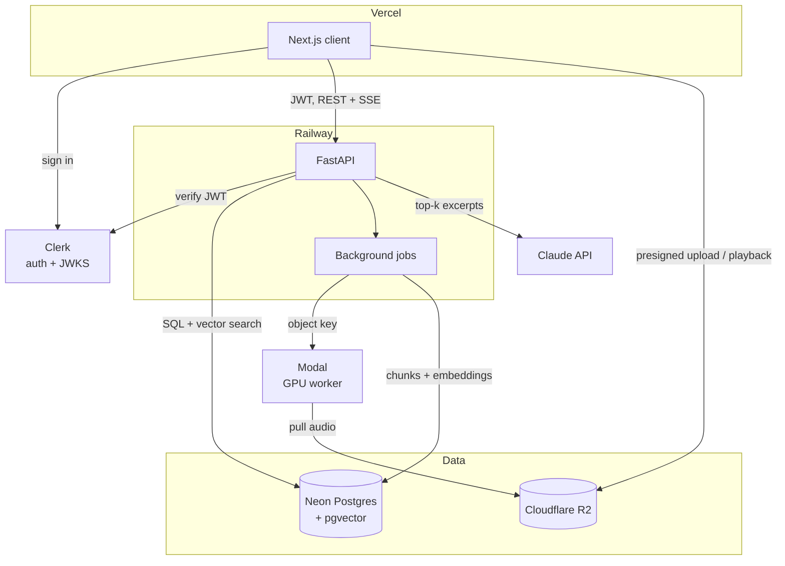
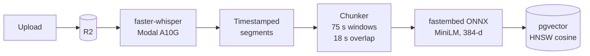
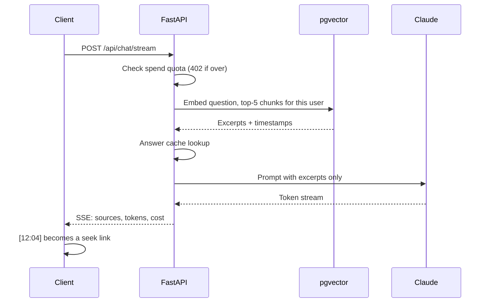
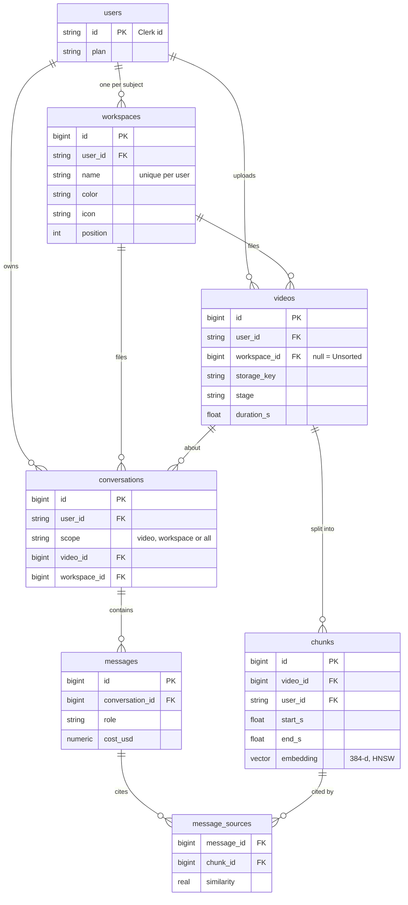

# Pumped Up Kicks

**Ask your lecture a question. Get the answer, and the exact second your professor said it.**

Upload a recorded lecture and ask in plain English. Every claim in the answer links to a timestamp like `[12:04]`, and clicking it jumps the video there. Answers come only from your own lectures. If the lecture didn't cover it, it says so.

---

## Architecture



Video never passes through the API: browser to R2 to Modal.

---

## Ingest pipeline



Status: `queued → transcribing → indexing → ready | failed`, stored on the video row and polled by the UI.

---

## Ask flow



---

## Data model



Plus `answer_cache` (cache key, answer, hit count). Foreign keys cascade on delete, except `workspace_id`: deleting a subject moves its lectures and chats to Unsorted.

---

## Key decisions

- **Time-window chunks.** 75 s windows with 18 s overlap keep an explanation whole across boundaries.
- **Vectors in Postgres.** Tenant filter, joins, and cascade deletes run in one database, with no separate vector store to sync.
- **Self-invalidating cache.** The key is a hash of model + scope + question + retrieved chunk IDs. Re-indexing changes the IDs, and an answer cached in one subject is never served in another.
- **Subjects scope the search.** A chat searches one lecture, one subject, Unsorted, or everything. The scope is stored on the conversation, so deleting a subject never widens what its chats search.
- **Ledger quotas.** Spend is summed from `messages.cost_usd` and checked before every Claude call.
- **Signed playback.** `<video>` can't send auth headers, so `/playback` returns a short-lived URL scoped to one object, one user, one expiry.
- **Swappable backends.** `STORAGE_BACKEND=local|r2`, `TRANSCRIBE_BACKEND=local|modal`.
- **Lean image.** ONNX embeddings (no PyTorch) plus GPU work on Modal take the API image from ~2.5 GB to ~300 MB.

---

## Tech stack

| | |
|---|---|
| **Frontend** | Next.js 15, React 18, TypeScript, Tailwind CSS, SSE |
| **API** | FastAPI, Pydantic v2, SQLAlchemy 2.0, Alembic |
| **Retrieval** | PostgreSQL 17, pgvector (HNSW), fastembed, all-MiniLM-L6-v2 |
| **Transcription** | faster-whisper on Modal (A10G) or local Whisper, ffmpeg |
| **LLM** | Claude (streaming, adaptive thinking, per-call cost tracking) |
| **Auth / Storage** | Clerk JWT, Cloudflare R2 (S3 API, presigned URLs) |
| **Deploy** | Vercel, Railway, Neon, Modal |

---

## Run locally

Needs Python 3.11+, Node 18+, ffmpeg, PostgreSQL 17 with pgvector, and an Anthropic API key.

```bash
# Database
brew install postgresql@17 pgvector && brew services start postgresql@17
createdb kicks_dev && psql -d kicks_dev -c "create extension vector;"

# API  ->  http://localhost:8000/docs
cd server
python3 -m venv venv && source venv/bin/activate
pip install -r requirements.txt -r requirements-local.txt
cp .env.example .env            # add ANTHROPIC_API_KEY
alembic upgrade head
./start_server.sh

# Client  ->  http://localhost:3000
cd client && npm install && npm run dev
```

`AUTH_MODE=dev` skips sign-in. Production setup (Clerk, R2, Modal, Neon, Railway, Vercel) is in [SETUP.md](SETUP.md).

---

## Known limits

- Jobs run in FastAPI `BackgroundTasks`, so a restart loses in-flight work. Next: Redis + RQ.
- Filtered HNSW recall drops as tenants grow. Next: `hnsw.iterative_scan` (pgvector 0.8+).
- English only. No full transcript view yet.

---

## Team

Sejal Hukare, Ishita Pawar, Rajvardhan Patil, Chetan Monhot
